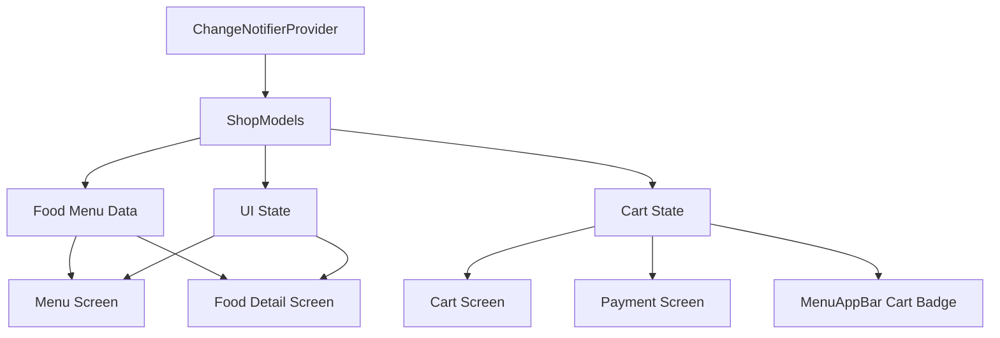
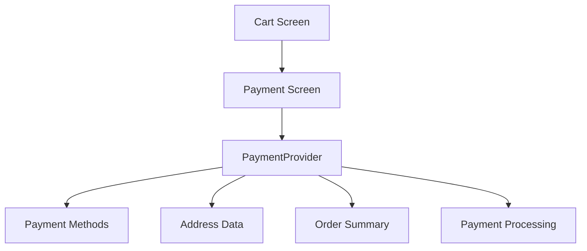

# Provider Optimization and Best Practices Analysis

## Executive Summary

This document provides a comprehensive review of the current Provider implementation in the UIApp Flutter project, identifies opportunities for optimization, and proposes improvements aligned with Flutter best practices. Additionally, it includes a complete design for a `PaymentScreen` that properly leverages Provider for state management.

---

## 1. Current State Management Analysis

### 1.1 Current Architecture Overview

The app currently uses a single `ChangeNotifierProvider` at the root level wrapping `MyApp` with `ShopModels` as the sole provider.

```dart
// lib/main.dart
void main() {
  runApp(
    ChangeNotifierProvider(
      create: (context) => ShopModels(),
      child: const MyApp(),
    ),
  );
}
```

### 1.2 Provider Usage Analysis

#### Current Strengths

1. **Single Provider at Root**: The app correctly places the Provider at the root level, making it accessible throughout the widget tree.
2. **Consumer Usage**: The `CartScreen` correctly uses `Consumer<ShopModels>` for rebuilding only the cart-dependent parts.
3. **Basic State Management**: The `ShopModels` class properly extends `ChangeNotifier` and uses `notifyListeners()`.

#### Current Issues Identified

| Issue | Location | Severity |
|-------|----------|----------|
| `context.read()` in build method | `menu_screen.dart:42` | High |
| Mixed setState and Provider | `menu_screen.dart:23`, `Food_detail_screen.dart:19` | High |
| No computed getters for cart totals | `ShopModels.dart` | Medium |
| Missing cart count in AppBar | `menu_app_bar.dart` | Medium |
| Inconsistent null safety usage | Multiple files | Medium |
| No cart persistence | `ShopModels.dart` | Low |
| Missing category filtering logic | `ShopModels.dart` | Low |

---

## 2. Provider Usage Issues Detailed

### 2.1 Issue: `context.read()` in Build Methods

**Problem Code:**
```dart
// lib/Screens/menu_screen.dart:42-43
final shop = context.read<ShopModels>();
final foodMenu = shop.foodMenu;
```

**Why This Is Problematic:**
- `context.read()` in a `build()` method can cause unexpected behavior when widgets rebuild
- It bypasses the widget lifecycle and may read stale data
- Flutter best practices recommend using `context.watch()` or `Consumer` for reactive data

**Recommended Fix:**
```dart
// Use Consumer or context.watch()
final shop = context.watch<ShopModels>();
final foodMenu = shop.foodMenu;
```

### 2.2 Issue: Mixed State Management Approaches

**Problem Code:**
```dart
// lib/Screens/menu_screen.dart:23
class _MenuScreenState extends State<MenuScreen> {
  String selectedCategory = "Sushi 🍣";  // Local setState
```

```dart
// lib/Screens/Food_detail_screen.dart:19
class _FoodDetailScreenState extends State<FoodDetailScreen> {
  int quantityCount = 0;  // Local setState
```

**Why This Is Problematic:**
- Mixing `setState` with Provider creates inconsistency
- Category selection state is local to `MenuScreen`, making it inaccessible elsewhere
- Quantity state is local, but cart operations use Provider
- Inconsistent data flow makes the app harder to maintain

**Recommended Fix:**
```dart
// Move these to ShopModels as computed state
String get selectedCategory => _selectedCategory;
setSelectedCategory(String category) {
  _selectedCategory = category;
  notifyListeners();
}
```

### 2.3 Issue: Missing Computed Getters

**Current Cart Implementation:**
```dart
// lib/models/Shop_models.dart:26-30
List<FoodModel> _cart = [];

List<FoodModel> get cart => _cart;
```

**Problem:**
- No getter for cart total price
- No getter for cart item count
- No getter for formatted totals
- Cart screen calculates totals inline (lines 62-69 in cart_screen.dart)

**Recommended Enhancement:**
```dart
// Add to ShopModels
int get cartItemCount => _cart.length;

double get cartTotal {
  return _cart.fold(0, (sum, item) => sum + (double.tryParse(item.price) ?? 0));
}

String get formattedCartTotal => '\$${cartTotal.toStringAsFixed(2)}';
```

---

## 3. Best Practices Recommendations

### 3.1 Follow Provider Pattern Guidelines

#### Do's

1. **Use `context.watch()` for reactive rebuilds:**
   ```dart
   @override
   Widget build(BuildContext context) {
     final cart = context.watch<ShopModels>().cart;
     // Rebuilds when cart changes
   }
   ```

2. **Use `Consumer` for fine-grained rebuilds:**
   ```dart
   Consumer<ShopModels>(
     builder: (context, shop, child) => Text('${shop.cartItemCount}'),
   )
   ```

3. **Use `context.read()` only in callbacks:**
   ```dart
   onPressed: () {
     context.read<ShopModels>().add_to_cart(food, quantity);
   }
   ```

4. **Separate read-only and mutable state:**
   ```dart
   // Good: Computed properties
   int get cartItemCount => _cart.length;
   double get cartTotal => ...
   ```

#### Don'ts

1. ❌ Don't use `context.read()` in `build()` methods
2. ❌ Don't mix `setState` with Provider for shared state
3. ❌ Don't put business logic directly in widgets
4. ❌ Don't forget to call `notifyListeners()` after state changes

### 3.2 Architecture Improvement Proposal



### 3.3 Recommended ShopModels Enhancement

```dart
// lib/models/shop_models.dart (Enhanced)
class ShopModels extends ChangeNotifier {
  // Food Menu
  final List<FoodModel> _foodMenu = [ /* existing data */ ];
  
  // Cart State
  List<FoodModel> _cart = [];
  
  // UI State
  String _selectedCategory = "Sushi 🍣";
  String _searchQuery = "";
  
  // Computed Getters
  List<FoodModel> get foodMenu => _foodMenu;
  List<FoodModel> get cart => _cart;
  int get cartItemCount => _cart.length;
  double get cartTotal => _cart.fold(0, (sum, item) => 
      sum + (double.tryParse(item.price) ?? 0));
  String get formattedCartTotal => '\$${cartTotal.toStringAsFixed(2)}';
  
  // UI State Getters/Setters
  String get selectedCategory => _selectedCategory;
  setSelectedCategory(String category) {
    _selectedCategory = category;
    notifyListeners();
  }
  
  String get searchQuery => _searchQuery;
  setSearchQuery(String query) {
    _searchQuery = query;
    notifyListeners();
  }
  
  // Filtered menu based on category and search
  List<FoodModel> get filteredMenu {
    return _foodMenu.where((food) {
      final matchesCategory = _selectedCategory == "Sushi 🍣" || 
          food.cacategory == _selectedCategory;
      final matchesSearch = _searchQuery.isEmpty || 
          food.name.toLowerCase().contains(_searchQuery.toLowerCase());
      return matchesCategory && matchesSearch;
    }).toList();
  }
  
  // Cart Operations (existing)
  void add_to_cart(FoodModel fooditem, int quantity) {
    for (int i = 0; i < quantity; i++) {
      _cart.add(fooditem);
    }
    notifyListeners();
  }
  
  void removefromthecart(FoodModel food) {
    _cart.remove(food);
    notifyListeners();
  }
  
  void clearCart() {
    _cart.clear();
    notifyListeners();
  }
}
```

### 3.4 MenuAppBar Enhancement

```dart
// lib/Components/menu_app_bar.dart (Enhanced)
class MenuAppBar extends StatelessWidget implements PreferredSizeWidget {
  // ... existing parameters
  
  @override
  Widget build(BuildContext context) {
    // Watch cart count from Provider
    final cartCount = context.select<ShopModels, int>(
      (shop) => shop.cartItemCount,
    );
    
    return AppBar(
      // ... existing code
      actions: [
        Stack(
          children: [
            IconButton(
              icon: Icon(Icons.shopping_bag_outlined, color: Colors.black),
              onPressed: onCartTap,
            ),
            // Cart Badge - now automatically updates
            if (cartCount > 0)
              Positioned(
                right: 8,
                top: 8,
                child: Container(
                  padding: EdgeInsets.all(4),
                  decoration: BoxDecoration(
                    color: Colors.red,
                    shape: BoxShape.circle,
                  ),
                  child: Text(
                    '$cartCount',
                    style: TextStyle(
                      color: Colors.white,
                      fontSize: 10,
                      fontWeight: FontWeight.bold,
                    ),
                  ),
                ),
              ),
          ],
        ),
      ],
    );
  }
}
```

---

## 4. Payment Screen Design

### 4.1 Overview

The `PaymentScreen` is a new screen that will be accessed from the Cart Screen. It will handle payment selection, address entry, and order confirmation.

### 4.2 Architecture Diagram



### 4.3 New Payment Provider

```dart
// lib/models/payment_provider.dart
import 'package:flutter/material.dart';
import 'shop_models.dart';

enum PaymentMethod {
  creditCard,
  debitCard,
  cashOnDelivery,
  wallet,
}

class PaymentProvider extends ChangeNotifier {
  // Payment State
  PaymentMethod _selectedPaymentMethod = PaymentMethod.creditCard;
  String _cardNumber = "";
  String _expiryDate = "";
  String _cvv = "";
  String _cardHolderName = "";
  String _deliveryAddress = "";
  String _city = "";
  String _postalCode = "";
  bool _isProcessing = false;
  String _errorMessage = "";
  
  // Computed State
  bool get canProceed => _validatePaymentDetails();
  bool get isProcessing => _isProcessing;
  String get errorMessage => _errorMessage;
  
  // Payment Method Selection
  PaymentMethod get selectedPaymentMethod => _selectedPaymentMethod;
  void setPaymentMethod(PaymentMethod method) {
    _selectedPaymentMethod = method;
    notifyListeners();
  }
  
  // Card Details
  void setCardNumber(String number) {
    _cardNumber = number.replaceAll(' ', '');
    notifyListeners();
  }
  
  void setExpiryDate(String date) {
    _expiryDate = date;
    notifyListeners();
  }
  
  void setCvv(String cvv) {
    _cvv = cvv;
    notifyListeners();
  }
  
  void setCardHolderName(String name) {
    _cardHolderName = name;
    notifyListeners();
  }
  
  // Address Details
  void setDeliveryAddress(String address) {
    _deliveryAddress = address;
    notifyListeners();
  }
  
  void setCity(String city) {
    _city = city;
    notifyListeners();
  }
  
  void setPostalCode(String code) {
    _postalCode = code;
    notifyListeners();
  }
  
  // Validation
  bool _validatePaymentDetails() {
    _errorMessage = "";
    
    switch (_selectedPaymentMethod) {
      case PaymentMethod.creditCard:
      case PaymentMethod.debitCard:
        if (_cardNumber.length < 16) {
          _errorMessage = "Invalid card number";
          return false;
        }
        if (_expiryDate.isEmpty || !_expiryDate.contains('/')) {
          _errorMessage = "Invalid expiry date";
          return false;
        }
        if (_cvv.length < 3) {
          _errorMessage = "Invalid CVV";
          return false;
        }
        if (_cardHolderName.isEmpty) {
          _errorMessage = "Card holder name required";
          return false;
        }
        break;
        
      case PaymentMethod.cashOnDelivery:
        if (_deliveryAddress.isEmpty) {
          _errorMessage = "Delivery address required";
          return false;
        }
        break;
        
      case PaymentMethod.wallet:
        // Wallet validation
        break;
    }
    
    if (_deliveryAddress.isEmpty) {
      _errorMessage = "Delivery address required";
      return false;
    }
    
    return true;
  }
  
  // Process Payment
  Future<bool> processPayment(double amount, BuildContext context) async {
    if (!canProceed) {
      notifyListeners();
      return false;
    }
    
    _isProcessing = true;
    notifyListeners();
    
    // Simulate payment processing
    await Future.delayed(Duration(seconds: 2));
    
    // In real app, this would call payment API
    _isProcessing = false;
    
    // Add to cart and clear cart on success
    final shop = context.read<ShopModels>();
    shop.clearCart();
    
    notifyListeners();
    return true;
  }
  
  // Reset
  void reset() {
    _cardNumber = "";
    _expiryDate = "";
    _cvv = "";
    _cardHolderName = "";
    _deliveryAddress = "";
    _city = "";
    _postalCode = "";
    _errorMessage = "";
    notifyListeners();
  }
}
```

### 4.4 Payment Screen Widget

```dart
// lib/Screens/payment_screen.dart
import 'package:flutter/material.dart';
import 'package:google_fonts/google_fonts.dart';
import 'package:provider/provider.dart';
import 'package:uiapp/Components/button.dart';
import 'package:uiapp/Components/menu_app_bar.dart';
import 'package:uiapp/Themes/Colors.dart';
import 'package:uiapp/models/shop_models.dart';
import 'package:uiapp/models/payment_provider.dart';

class PaymentScreen extends StatelessWidget {
  const PaymentScreen({super.key});

  @override
  Widget build(BuildContext context) {
    return MultiProvider(
      providers: [
        ChangeNotifierProvider(create: (_) => PaymentProvider()),
      ],
      child: PaymentScreenContent(),
    );
  }
}

class PaymentScreenContent extends StatefulWidget {
  const PaymentScreenContent({super.key});

  @override
  State<PaymentScreenContent> createState() => _PaymentScreenContentState();
}

class _PaymentScreenContentState extends State<PaymentScreenContent> {
  final _addressController = TextEditingController();
  final _cityController = TextEditingController();
  final _postalCodeController = TextEditingController();
  final _cardNumberController = TextEditingController();
  final _expiryController = TextEditingController();
  final _cvvController = TextEditingController();
  final _cardHolderController = TextEditingController();

  @override
  void dispose() {
    _addressController.dispose();
    _cityController.dispose();
    _postalCodeController.dispose();
    _cardNumberController.dispose();
    _expiryController.dispose();
    _cvvController.dispose();
    _cardHolderController.dispose();
    super.dispose();
  }

  @override
  Widget build(BuildContext context) {
    final paymentProvider = context.watch<PaymentProvider>();
    final shop = context.watch<ShopModels>();

    return Scaffold(
      backgroundColor: Colors.grey[100],
      appBar: MenuAppBar(
        location: 'Checkout',
        subtitle: 'Complete your order',
        onMenuTap: () {},
        onCartTap: () {},
        onLocationTap: () {},
        quantityCount: shop.cartItemCount,
      ),
      body: SafeArea(
        child: SingleChildScrollView(
          padding: EdgeInsets.all(16),
          child: Column(
            crossAxisAlignment: CrossAxisAlignment.start,
            children: [
              // Order Summary
              _buildOrderSummary(context, shop),
              SizedBox(height: 20),
              
              // Payment Method Selection
              _buildPaymentMethods(context, paymentProvider),
              SizedBox(height: 20),
              
              // Conditional Payment Fields
              if (paymentProvider.selectedPaymentMethod == PaymentMethod.creditCard ||
                  paymentProvider.selectedPaymentMethod == PaymentMethod.debitCard)
                _buildCardPaymentFields(context, paymentProvider),
              
              if (paymentProvider.selectedPaymentMethod == PaymentMethod.cashOnDelivery)
                _buildCashOnDeliveryFields(context, paymentProvider),
              
              SizedBox(height: 20),
              
              // Error Message
              if (paymentProvider.errorMessage.isNotEmpty)
                Container(
                  padding: EdgeInsets.all(12),
                  decoration: BoxDecoration(
                    color: Colors.red[100],
                    borderRadius: BorderRadius.circular(8),
                  ),
                  child: Text(
                    paymentProvider.errorMessage,
                    style: TextStyle(color: Colors.red[800]),
                  ),
                ),
              
              SizedBox(height: 20),
              
              // Pay Button
              paymentProvider.isProcessing
                  ? Center(child: CircularProgressIndicator())
                  : MyButton(
                      text: 'Pay ${shop.formattedCartTotal}',
                      onTap: () async {
                        final success = await paymentProvider.processPayment(
                          shop.cartTotal,
                          context,
                        );
                        if (success) {
                          _showPaymentSuccessDialog(context);
                        }
                      },
                    ),
            ],
          ),
        ),
      ),
    );
  }

  Widget _buildOrderSummary(BuildContext context, ShopModels shop) {
    return Container(
      padding: EdgeInsets.all(16),
      decoration: BoxDecoration(
        color: Colors.white,
        borderRadius: BorderRadius.circular(12),
        boxShadow: [
          BoxShadow(
            color: Colors.black.withValues(alpha: 0.05),
            blurRadius: 10,
          ),
        ],
      ),
      child: Column(
        crossAxisAlignment: CrossAxisAlignment.start,
        children: [
          Text(
            'Order Summary',
            style: GoogleFonts.dmSans(
              fontSize: 18,
              fontWeight: FontWeight.bold,
            ),
          ),
          SizedBox(height: 12),
          Row(
            mainAxisAlignment: MainAxisAlignment.spaceBetween,
            children: [
              Text('Items (${shop.cartItemCount})'),
              Text(shop.formattedCartTotal),
            ],
          ),
          SizedBox(height: 8),
          Row(
            mainAxisAlignment: MainAxisAlignment.spaceBetween,
            children: [
              Text('Delivery'),
              Text('\$5.00'),
            ],
          ),
          Divider(height: 16),
          Row(
            mainAxisAlignment: MainAxisAlignment.spaceBetween,
            children: [
              Text(
                'Total',
                style: TextStyle(fontWeight: FontWeight.bold, fontSize: 16),
              ),
              Text(
                '\$${(shop.cartTotal + 5).toStringAsFixed(2)}',
                style: TextStyle(
                  fontWeight: FontWeight.bold,
                  fontSize: 16,
                  color: primaryColor,
                ),
              ),
            ],
          ),
        ],
      ),
    );
  }

  Widget _buildPaymentMethods(BuildContext context, PaymentProvider payment) {
    return Container(
      padding: EdgeInsets.all(16),
      decoration: BoxDecoration(
        color: Colors.white,
        borderRadius: BorderRadius.circular(12),
      ),
      child: Column(
        crossAxisAlignment: CrossAxisAlignment.start,
        children: [
          Text(
            'Payment Method',
            style: GoogleFonts.dmSans(
              fontSize: 18,
              fontWeight: FontWeight.bold,
            ),
          ),
          SizedBox(height: 12),
          _buildPaymentOption(
            context,
            'Credit Card',
            Icons.credit_card,
            PaymentMethod.creditCard,
            payment,
          ),
          _buildPaymentOption(
            context,
            'Debit Card',
            Icons.credit_card,
            PaymentMethod.debitCard,
            payment,
          ),
          _buildPaymentOption(
            context,
            'Cash on Delivery',
            Icons.money,
            PaymentMethod.cashOnDelivery,
            payment,
          ),
          _buildPaymentOption(
            context,
            'Wallet',
            Icons.account_balance_wallet,
            PaymentMethod.wallet,
            payment,
          ),
        ],
      ),
    );
  }

  Widget _buildPaymentOption(
    BuildContext context,
    String title,
    IconData icon,
    PaymentMethod method,
    PaymentProvider payment,
  ) {
    final isSelected = payment.selectedPaymentMethod == method;
    
    return GestureDetector(
      onTap: () => payment.setPaymentMethod(method),
      child: Container(
        margin: EdgeInsets.only(bottom: 8),
        padding: EdgeInsets.all(12),
        decoration: BoxDecoration(
          color: isSelected ? primaryColor.withValues(alpha: 0.1) : Colors.grey[100],
          borderRadius: BorderRadius.circular(8),
          border: Border.all(
            color: isSelected ? primaryColor : Colors.transparent,
            width: 2,
          ),
        ),
        child: Row(
          children: [
            Icon(icon, color: isSelected ? primaryColor : Colors.grey),
            SizedBox(width: 12),
            Text(
              title,
              style: TextStyle(
                fontWeight: isSelected ? FontWeight.bold : FontWeight.normal,
              ),
            ),
          ],
        ),
      ),
    );
  }

  Widget _buildCardPaymentFields(BuildContext context, PaymentProvider payment) {
    return Container(
      padding: EdgeInsets.all(16),
      decoration: BoxDecoration(
        color: Colors.white,
        borderRadius: BorderRadius.circular(12),
      ),
      child: Column(
        crossAxisAlignment: CrossAxisAlignment.start,
        children: [
          Text(
            'Card Details',
            style: GoogleFonts.dmSans(
              fontSize: 18,
              fontWeight: FontWeight.bold,
            ),
          ),
          SizedBox(height: 12),
          _buildTextField(
            context,
            'Card Number',
            _cardNumberController,
            TextInputType.number,
            (value) => payment.setCardNumber(value),
          ),
          Row(
            children: [
              Expanded(
                child: _buildTextField(
                  context,
                  'Expiry (MM/YY)',
                  _expiryController,
                  TextInputType.number,
                  (value) => payment.setExpiryDate(value),
                ),
              ),
              SizedBox(width: 12),
              Expanded(
                child: _buildTextField(
                  context,
                  'CVV',
                  _cvvController,
                  TextInputType.number,
                  (value) => payment.setCvv(value),
                  obscureText: true,
                ),
              ),
            ],
          ),
          _buildTextField(
            context,
            'Card Holder Name',
            _cardHolderController,
            TextInputType.text,
            (value) => payment.setCardHolderName(value),
          ),
          SizedBox(height: 12),
          _buildAddressFields(context, payment),
        ],
      ),
    );
  }

  Widget _buildCashOnDeliveryFields(BuildContext context, PaymentProvider payment) {
    return Container(
      padding: EdgeInsets.all(16),
      decoration: BoxDecoration(
        color: Colors.white,
        borderRadius: BorderRadius.circular(12),
      ),
      child: Column(
        crossAxisAlignment: CrossAxisAlignment.start,
        children: [
          Text(
            'Delivery Address',
            style: GoogleFonts.dmSans(
              fontSize: 18,
              fontWeight: FontWeight.bold,
            ),
          ),
          SizedBox(height: 12),
          _buildTextField(
            context,
            'Full Address',
            _addressController,
            TextInputType.streetAddress,
            (value) => payment.setDeliveryAddress(value),
            maxLines: 3,
          ),
          Row(
            children: [
              Expanded(
                child: _buildTextField(
                  context,
                  'City',
                  _cityController,
                  TextInputType.text,
                  (value) => payment.setCity(value),
                ),
              ),
              SizedBox(width: 12),
              Expanded(
                child: _buildTextField(
                  context,
                  'Postal Code',
                  _postalCodeController,
                  TextInputType.number,
                  (value) => payment.setPostalCode(value),
                ),
              ),
            ],
          ),
        ],
      ),
    );
  }

  Widget _buildAddressFields(BuildContext context, PaymentProvider payment) {
    return Column(
      children: [
        _buildTextField(
          context,
          'Delivery Address',
          _addressController,
          TextInputType.streetAddress,
          (value) => payment.setDeliveryAddress(value),
          maxLines: 3,
        ),
        Row(
          children: [
            Expanded(
              child: _buildTextField(
                context,
                'City',
                _cityController,
                TextInputType.text,
                (value) => payment.setCity(value),
              ),
            ),
            SizedBox(width: 12),
            Expanded(
              child: _buildTextField(
                context,
                'Postal Code',
                _postalCodeController,
                TextInputType.number,
                (value) => payment.setPostalCode(value),
              ),
            ),
          ],
        ),
      ],
    );
  }

  Widget _buildTextField(
    BuildContext context,
    String label,
    TextEditingController controller,
    TextInputType keyboardType,
    ValueChanged<String> onChanged, {
    bool obscureText = false,
    int maxLines = 1,
  }) {
    return Column(
      crossAxisAlignment: CrossAxisAlignment.start,
      children: [
        Text(
          label,
          style: TextStyle(
            fontSize: 14,
            fontWeight: FontWeight.w500,
            color: Colors.grey[700],
          ),
        ),
        SizedBox(height: 6),
        TextField(
          controller: controller,
          keyboardType: keyboardType,
          obscureText: obscureText,
          maxLines: maxLines,
          onChanged: onChanged,
          decoration: InputDecoration(
            filled: true,
            fillColor: Colors.grey[100],
            border: OutlineInputBorder(
              borderRadius: BorderRadius.circular(8),
              borderSide: BorderSide.none,
            ),
            contentPadding: EdgeInsets.symmetric(horizontal: 12, vertical: 12),
          ),
        ),
        SizedBox(height: 12),
      ],
    );
  }

  void _showPaymentSuccessDialog(BuildContext context) {
    showDialog(
      context: context,
      builder: (context) => AlertDialog(
        title: Text('Payment Successful!'),
        content: Text('Your order has been placed successfully.'),
        actions: [
          TextButton(
            onPressed: () {
              Navigator.popUntil(context, (route) => route.isFirst);
            },
            child: Text('OK'),
          ),
        ],
      ),
    );
  }
}
```

---

## 5. Implementation Roadmap

### Phase 1: Critical Fixes

1. [ ] Replace `context.read()` with `context.watch()` in `menu_screen.dart`
2. [ ] Move `selectedCategory` state to `ShopModels`
3. [ ] Move `quantityCount` state to `ShopModels`
4. [ ] Add computed getters (`cartItemCount`, `cartTotal`, `formattedCartTotal`) to `ShopModels`

### Phase 2: Provider Optimization

1. [ ] Update `MenuAppBar` to use `context.select()` for cart badge
2. [ ] Update `CartScreen` to use computed getters
3. [ ] Remove manual price calculations from widgets
4. [ ] Add cart persistence using `shared_preferences` or `hive`

### Phase 3: New Features

1. [ ] Create `payment_provider.dart`
2. [ ] Create `payment_screen.dart`
3. [ ] Add payment routes to `main.dart`
4. [ ] Connect "Pay Now" button in `CartScreen` to `PaymentScreen`

### Phase 4: Enhanced Features

1. [ ] Add category filtering to `ShopModels`
2. [ ] Add search functionality to `ShopModels`
3. [ ] Implement `filteredMenu` getter
4. [ ] Add unit tests for `ShopModels`

---

## 6. Summary

### Current State

- Basic Provider implementation with single `ShopModels` provider
- Mix of `setState` and Provider state management
- Missing computed getters and computed state
- No payment functionality

### Recommended Changes

1. **Fix `context.read()` usage** - Replace with `context.watch()` or `Consumer`
2. **Remove mixed state management** - Move all shared state to Provider
3. **Add computed getters** - Calculate totals, counts, and formatted values in Provider
4. **Enhance MenuAppBar** - Use `context.select()` for cart badge updates
5. **Implement PaymentScreen** - New screen with dedicated `PaymentProvider`

### Benefits

- **Cleaner Architecture**: Single source of truth for all state
- **Better Performance**: Selective rebuilds using `context.select()`
- **Easier Maintenance**: Business logic separated from UI
- **Scalability**: Easy to add new features (orders, history, user profile)
- **Testability**: Provider logic can be unit tested independently

### Risk Mitigation

- Phase 1 changes are low-risk and improve code quality
- Phase 3 introduces new functionality without modifying existing code
- All changes are backward compatible with current implementation

---

## 7. Files to Create/Modify

### New Files

| File | Purpose |
|------|---------|
| `lib/models/payment_provider.dart` | Payment state management |
| `lib/Screens/payment_screen.dart` | Payment UI screen |

### Modified Files

| File | Changes |
|------|---------|
| `lib/main.dart` | Add payment route |
| `lib/models/shop_models.dart` | Add computed getters, move state |
| `lib/Screens/menu_screen.dart` | Use context.watch() |
| `lib/Screens/cart_screen.dart` | Use computed getters, connect to payment |
| `lib/Components/menu_app_bar.dart` | Use context.select() for badge |
| `lib/Screens/Food_detail_screen.dart` | Use Provider for quantity |

---

*Document generated for UIApp Flutter project optimization*
